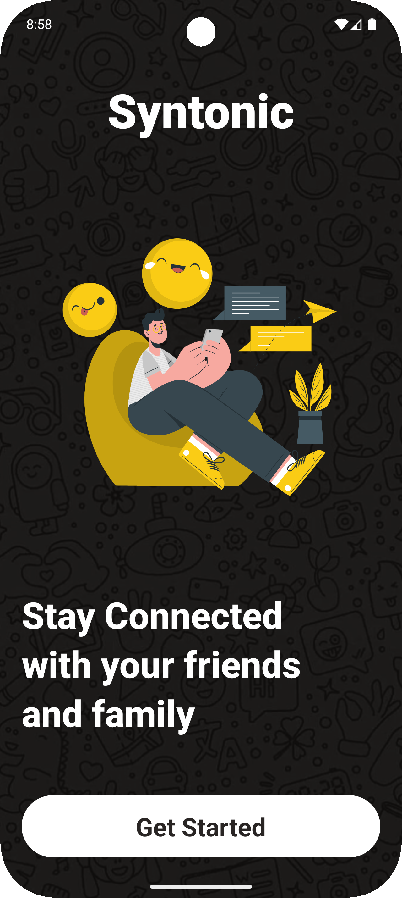
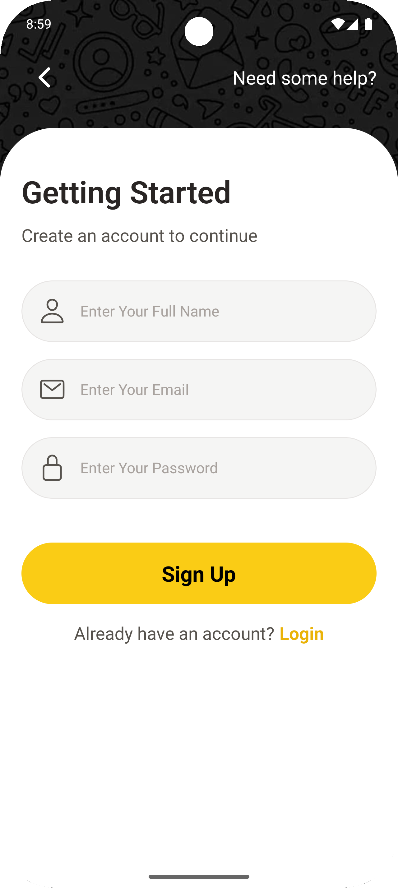
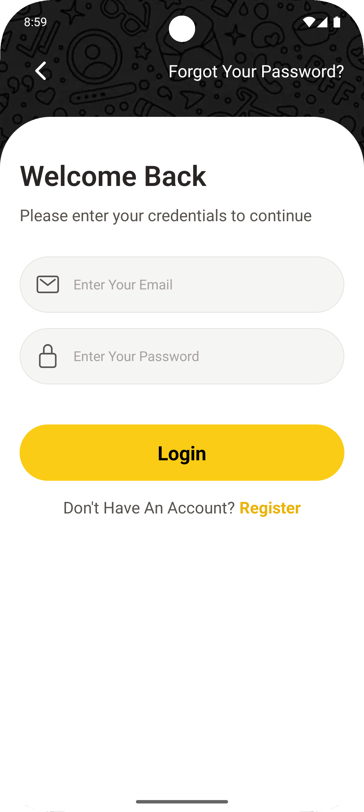
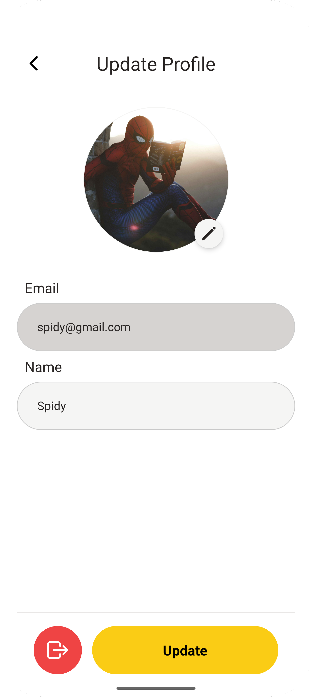
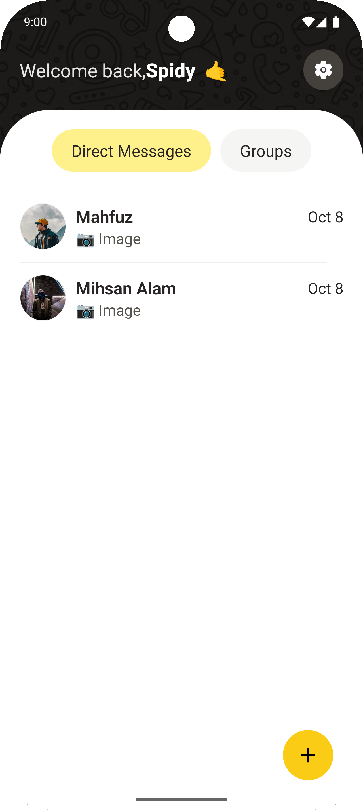
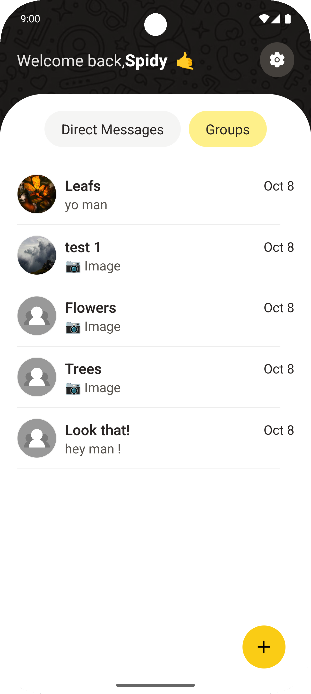

# Chat_app_JC 🚀

A real-time chat application built with Socket.IO and React — designed for seamless communication with modern UI and backend support.

---

## 🧩 Features

-   Real-time messaging using **Socket.IO**
-   Responsive frontend with chat interface and user list
-   Basic authentication (signup / login)
-   Clean architecture: **frontend** & **backend** separation
-   Beginner-friendly code structure — great for learning
-   Easily extendable: add group chats, media sharing, etc.

---

## 🛠️ Tech Stack

| Layer    | Technologies                               |
| :------- | :----------------------------------------- |
| Frontend | ReactNative, StyleSheet, Socket.IO Client |
| Backend  | Node.js, Express, Socket.IO Server         |
| Database | MongoDB          |
| Others   | Axios , JWT / Auth, etc.          |

---

## 📂 Project StructureChat_app_JC/
├── frontend/ # ReactNative application (UI, socket client)

├── backend/ # Node.js server (socket server, APIs)

├── README.md

└── .gitignore

---

## 📷 Screenshots (Preview)

Here are some screenshots to give a visual overview of the application:

<table>
  <tr>
    <td></td>
    <td width="30"></td>
    <td></td>
    <td width="30"></td>
    <td></td>
  </tr>
  <tr><td colspan="5" height="20"></td></tr> <!-- vertical gap -->
  <tr>
    <td></td>
    <td width="30"></td>
    <td></td>
    <td width="30"></td>
    <td></td>
  </tr>
</table>

## 🎯 Future Improvements          
- Group chat & channels   
- Media file sharing (audio, videos)     
- Read receipts, typing indicators   
- Better authentication (JWT, social login)   
- call system for direct communication                
- etc more....     
## 👤 About Me
I’m a frontend-enthusiast who loves building real-world projects while learning new technologies. This Chat App is one of my early full-stack works.
